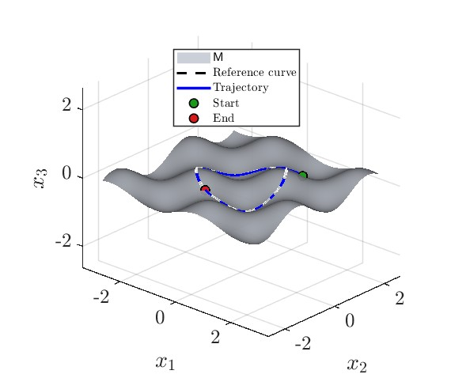
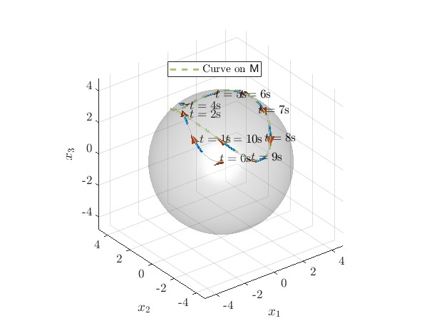
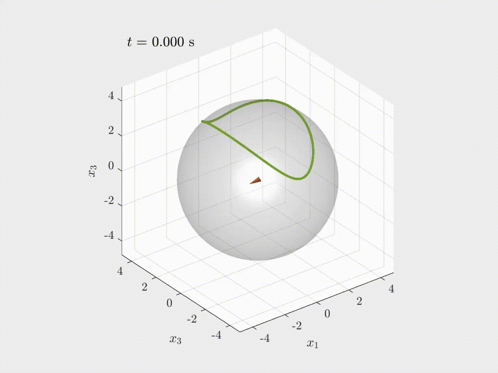

# Unicycle on Manifolds

This repository contains **MATLAB implementations of unicycle dynamics on manifolds**, together with simulations, visualizations, and animations for a CDC project.

## Project Page

The project webpage with animations and additional details will be available here:

🔗 https://gradslab.github.io/UnicycleOnManifolds/

## Simulation Scenarios

Two formulations are studied:

- **Dynamic formulation**
- **Fixed-velocity formulation**

The repository includes simulation scripts, visualization utilities, and webpage assets.

All webpage figures and animations are stored in **`docs/static/image/`**.

---

# Repository Structure

    .
    ├── FaceImage/
    ├── dynamic/
    │   ├── manifold_sphere_curve_1/
    │   ├── manifold_sphere_curve_2/
    │   └── manifold_sphere_curve_3/
    ├── fixed_v/
    │   ├── manifold_sphere_curve_1/
    │   ├── manifold_sphere_curve_2/
    │   └── manifold_sphere_curve_3/
    ├── docs/
    │   ├── _config.yml
    │   ├── index.md
    │   ├── _layouts/
    │   ├── _site/
    │   └── static/
    │       └── image/
    ├── .gitignore
    └── README.md

- `dynamic/` contains dynamic-formulation simulations.
- `fixed_v/` contains fixed-velocity simulations.
- `FaceImage/` contains helper scripts for image and vector export.
- `docs/` contains the Jekyll source for the project webpage.

---

# Running the Simulations

Open MATLAB in the repository root and run an experiment script such as:

    run('dynamic/manifold_sphere_curve_2/main.m')

or

    run('fixed_v/manifold_sphere_curve_1/main.m')

Each experiment folder contains scripts for simulation, animation, and visualization.

---

# Example Results

## Dynamic Formulation

  
  

## Fixed-Velocity Formulation

  
  

---

# Notes

- Generated artifacts and temporary files are excluded through `.gitignore`.
- `docs/_site/` is generated automatically by Jekyll and should not be edited manually.

---

# Citation

If you use this code in academic work, please cite the associated paper once the bibliographic information is available.
